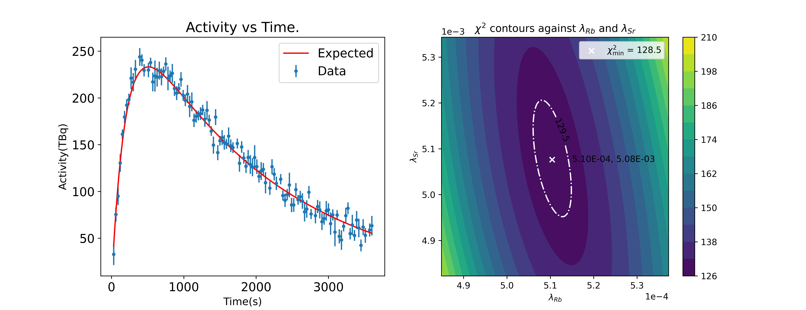

# Nuclear Decay Analysis Using Python

This repository contains a Python-based project for analysing nuclear decay data. The project is designed to calculate best-fit estimates of decay constants and half-lives of two isotopes, with uncertainties. It also provides a chi-squared analysis and contour plotting. The results of this project are visualized through plots of activity vs time and chi-squared contour plots.

## Files in this Repository

- **nuclear_decay.py**: The main script for running the nuclear decay analysis. It reads in CSV files containing nuclear data, calculates decay constants and half-lives, and generates visualizations.
- **decay_utils.py**: A utility module supporting the decay analysis, containing helper functions for console handling, validation, benchmarking, and more.
- **Nuclear_data_1.csv** and **Nuclear_data_2.csv**: Example datasets containing the nuclear decay data in terms of time, activity, and uncertainty.
- **decay_plots.png**: A plot generated by the program. The left-hand plot shows the activity vs time, while the right-hand plot presents the chi-squared contours against the decay constants for two isotopes.

## Project Description

The goal of this project is to analyze the decay of two isotopes, 79-Rb and 89-Sr, using time series data of their activities. The program estimates decay constants and half-lives using best-fit models based on least-squares minimization. The key features of the project include:

- **Activity vs Time Plot**: This plot compares the actual data against the best-fit model for decay activity over time.
- **Chi-Squared Contour Plot**: This shows the variation of chi-squared values across different possible decay constants, helping to visualize the uncertainties and confidence intervals in the parameter estimation.

The results of this analysis are useful for understanding the decay dynamics of radioactive isotopes, and the project demonstrates how Python can be used for scientific data analysis and visualization.

## How to Run

1. Clone this repository.
2. Ensure you have the required Python libraries: `numpy`, `matplotlib`, and `scipy`.
3. Run the `nuclear_decay.py` file to begin the analysis.
4. Input your data files in CSV format when prompted, or use the provided sample datasets.

## Visual Output

The output will generate two visualizations: one for the activity vs time comparison, and another for the chi-squared contour plot, as shown above.
